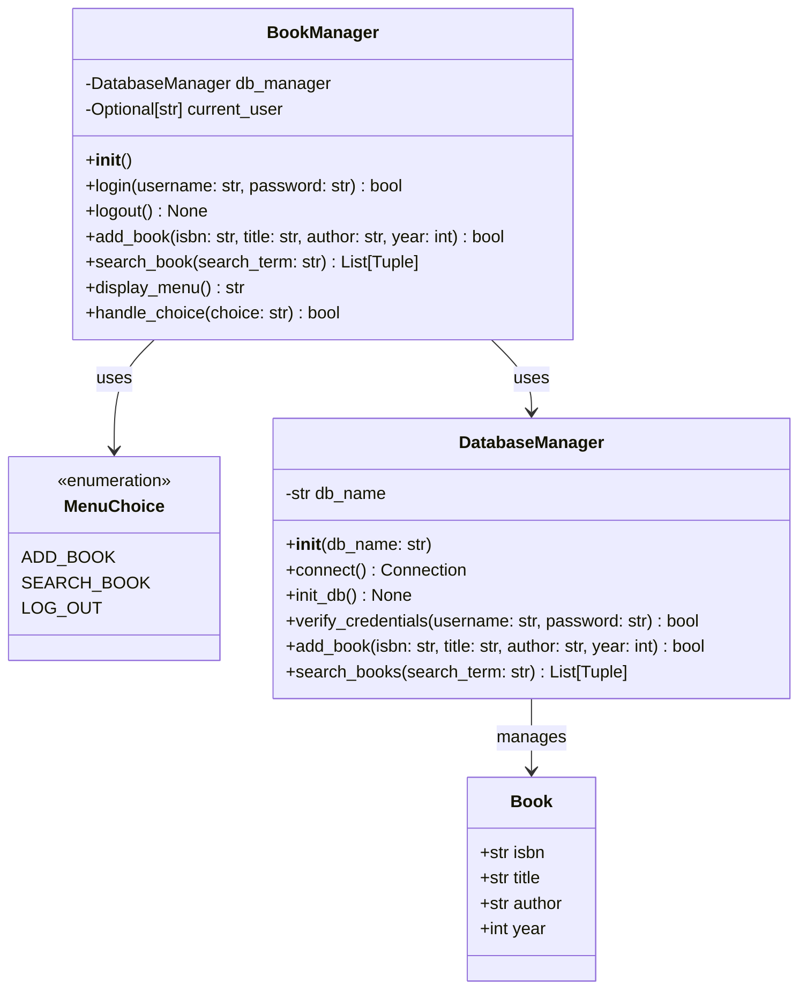
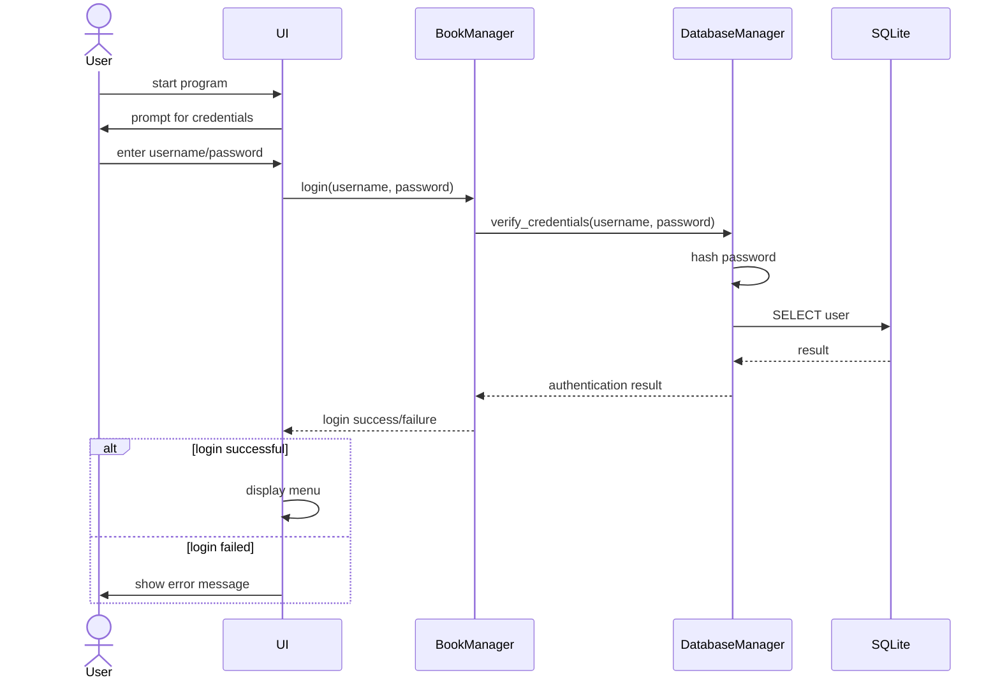
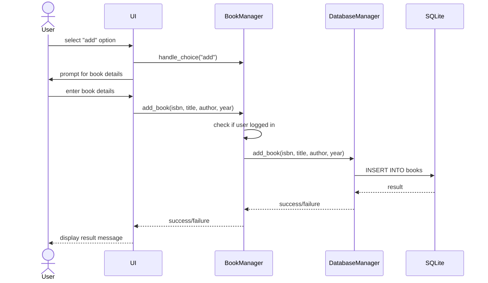
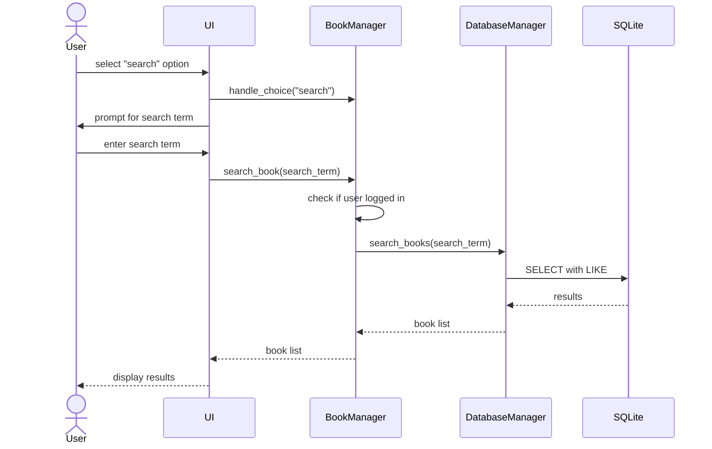

# Book Management System

Author: Tripp Lamb

Date (Last Updated): 11/9/2024

Class: CS 521-01

Developer Tools: Made using Windows in VS Code IDE

Extensions:
- Markdown Preview Mermaid Support
- Mermaid Markdown Syntax Highlighting
- Python (Microsoft)
- Python Debugger (Microsoft)

Languages: python, sqlite, mermaid, markdown

Welcome to the Book Management System. It is an application that allows a user to login if their name is in the database. Then the user is allowed 3 options: Add a book, search for books, and log out. The program will exit when logged out and will need to be restarted if the user desires to use a different user name. There isn't much value in that since all users including admin have the same privileges and the user data isn't stored in the book data when a book is added. Below there is a description of how to use the application. Further down there is a brief UML description of the software system with Class, Use Case, and Sequence Diagrams. Additionally if the reader has no method to preview markdown there is a pdf version of this file available in this directory.


## How to use

To use the first time you may simply run "main.py" and will be given the option to login. If the user `admin` is not currently present in the table a new user with user name `admin` will be added with a default password `password`. Passwords are hashed, so they will not be able to be stolen. Security is still important though so go ahead and change the password using the "add_user.py" script. If the added user exists, the script will overwrite the current password, and if the user doesn't exist they will be added to the database with the given password. The "add_user.py" script should not be public facing.

### Warning

There is no input sanitation, so only allow users you trust to access the system.

## Class Diagram



## Use Case Diagram

 ```mermaid
graph TB
    subgraph Book Management System
        Login[Login]
        AddBook[Add Book]
        SearchBook[Search Book]
        LogOut[Log Out]
        Auth[Authentication]
        DB[Database Operations]
    end

    User((User))
    Admin((Admin))

    User --> Login
    User --> AddBook
    User --> SearchBook
    User --> LogOut

    Admin --> AddUser[Add/Update User]

    Login --> Auth
    AddBook --> DB
    SearchBook --> DB
    AddUser --> DB

```

## Sequence Diagrams

### Log In Sequence

The first sequence available to the user.


### Add Book Sequence

The first option once the log in sequence has sucessfully completed. It allows the user to add a book to the database.


### Search Book Sequence

The second option once the log in sequence has sucessfully completed. It allows the user to search the database.



### Log Out Sequence

The third option once the log in sequence has sucessfully completed. No UML is given since the action is simply the UI terminates the application. There are not currently any steps. The application is not complex enought to necessitate a complex shut down process.