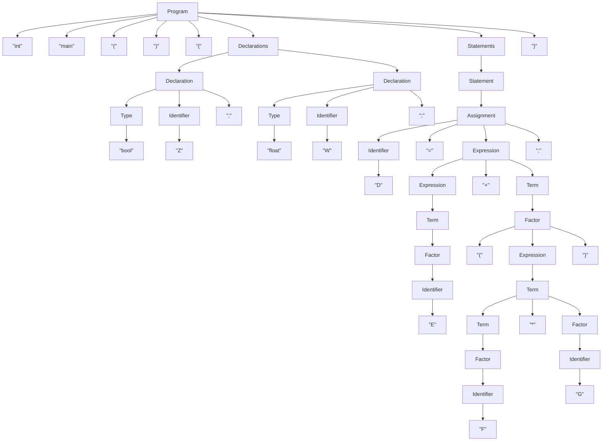

# Problem Set A

## Problem 1

### 1(a) Readability

#### Definitions

1. A measure of the ease with which programs can be read and understood by humans. 

   > H.S. Delugach, 01-overview.pdf notes for CS-424/524

2. The ease with which a human reader can comprehend the purpose, control flow, and operation of source code.

   > Wikipedia, Computer Programming Readability of Source Code https://en.wikipedia.org/wiki/Computer_programming#Readability_of_source_code

#### Comparison

Both of these definitions are fairly similar, then again of the several definitions I found all of them were fairly similar and most seemed to stem directly from the assigned text book *Concepts of Programming Languages* by Robert W. Sebesta. The second definition is slightly more useful in understanding the concept only in that it further clarifies what exactly is meant by 'programs'; however, in the context of the notes/textbook there really is no ambiguity. In either definition the purpose is fairly straight forward. Readability is important for software because people need to be able to read software. In both cases the source goes on to discuss the specifics of each definition stating that the concept of readability is a combination of the characteristics of simplicity, orthogonality, datatypes, and syntax design. This put simply is that a programming language with high readability would allow for understandability from even non-programmers due to it's small vocabulary, lack of exceptions, obvious organization and closeness to the natural language of the reader.

#### Example

Below is an example of a language Uiua with low readability which is common in stack-based array languages that make heavy use of glyphs. The code below generates the first 12 numbers of the Fibonacci sequence:

```
⇌[⍥⊃+⊙∘10 1 0]
```

And here are two identical options for declaring an array variable in Modern Fortan, and although this is debatably a matter of personal preference I believe the first to be significantly more readable than the second.

```fortran
real, dimension(3) :: vector
```

```fortran
real :: vector(3)
```

### 1(b) Abstraction

#### Definitions

1. A view or representation of an entity that includes only the most significant attributes.

   > Robert W. Sebesta Concepts of programming languages, 12th edition, Page 448.

2. A less detailed representation of an object or concept in nature.

   > Ryan Michael Kay, What is Abstraction in Programming? Explained for Beginners, https://www.freecodecamp.org/news/what-is-abstraction-in-programming-for-beginners/

#### Comparison

Once again the two definitions are very similar. The second definition is easier to explain to a non-programmer, or beginner as was intended, at a high level, but the first definition is more useful for this context. Interestingly I'd never explicitly thought about abstraction in this particular way. Usually when I use the term abstraction I'm referring to the process of taking two highly-specific concepts or algorithms and combining them into something more generic to improve writability and maintainability, hopefully while minimizing the reduction of readability. These definitions as stated; however, have placed the focus of abstraction on improving readability by removing unnecessary information. This readability centric abstraction process is certainly one I have employed, but until now I'd never really considered it another instantiation of the same process. 

Using this definition (or my previous one) it seems counter intuitive to the fact that support for abstraction is not a characteristic attributed to affect readability according to *Concepts of Programming Languages*. Perhaps though that should be attributed to the readability of the program source rather than the language itself.

#### Example

Below is a simple example (in Fortran) of the helpful abstraction of process of converting from degrees to radians. (I'm use the compiler flag to set the default kind of `real` )

Before abstraction:

```fortran
Program Main
	real :: radians

	radians = 62.0 * 4.0 * ATAN(1) / 180.0
End Program
```

After abstraction:

```fortran
Program Main
	real, parameter :: pi = 4.0 * ATAN(1)

	real :: radians

	radians = degrees_to_radians(62.0)

contains

	function degrees_to_radians(d) result(r)

		!arguments
		real, intent(in) :: d ! [degrees] input value
	
		!output
		real :: r ! [radians] output value
	
		r = d * pi / 180.0

	end function degrees_to_radians
End Program
```

### 1(c) Writability

#### Definitions

1. A measure of the ease with which a language can be used by humans to create programs to solve problems in a chosen domain.

   > H.S. Delugach, 01-overview.pdf notes for CS-424/524

2. The quality of expressivity in a language. 

   > Loren K. Rhodes, Design Criteria for Programming Languages, https://jcsites.juniata.edu/faculty/rhodes/lt/plcriteria.htm

#### Comparison

The second definition is very abstract and academic, and while not incorrect more serves to only define the idea for those that already understand it. The first definition is much better for understanding the concept. Writability is largely a superset of readability since in many cases the ability to read easily translates to the ability to write easily. This is not always the case. In some cases succinctness of language can cause a drop in readability (see Uiua example above).

#### Example

The below example shows the difference in writability of array manipulation in Fortran versus JavaScript.

Fortran:

```fortran
real, dimension(3) :: x, y, z !declare 3, 3 length vectors named x, y, and z

x = 100.0               ! initialize all values in x to 100.0
y = (/1.0, 2.0, 3.0/)   ! using the old temporary array method initialize y
z = [10.0, 11.0, 12.0]  ! using the new temporary array method initialize z

z = z + y + x           ! add arrays using array addition

! z now equals [111.0, 113.0, 115.0]
```

JavaScript (Explicit Loops):

```javascript
// Declare and initialize arrays
let x = new Array(3).fill(100.0);        // initialize all values in x to 100.0
let y = [1.0, 2.0, 3.0];                 // initialize y with specific values
let z = [10.0, 11.0, 12.0];              // initialize z with specific values

// Element-wise addition using a loop
for (let i = 0; i < 3; i++) {
    z[i] = z[i] + y[i] + x[i];           // add element-wise
}
// z now equals [111.0, 113.0, 115.0]
```

JavaScript (using map / list comprehension-esque)

```javascript
// Declare and initialize arrays
let x = [100.0, 100.0, 100.0];           // initialize all values in x to 100.0
let y = [1.0, 2.0, 3.0];                 // initialize y with specific values
let z = [10.0, 11.0, 12.0];              // initialize z with specific values

// Element-wise addition: z = z + y + x
z = z.map((val, i) => val + y[i] + x[i]); // add element-wise
// z now equals [111.0, 113.0, 115.0]
```

## Problem 2

### 2(a) Syntax vs. Semantics

Syntax of a programming language refers to the validity of the form of the source code. Valid syntax implies that the source code can be properly tokenized and generate an abstract syntax tree without error according to the grammar of the language. Semantics on the other hand refers to the validity of the meaning of the code. Valid semantics means that the order and scope of the grammar structures are

- properly connected
- exist in a valid order
- types are operated on correctly
- meaningful operations

For example a syntax error would occur if an unexpected character or token occurred while a semantics error would occur if an identifier was attempted to be used before it was declared.

### 2(b) Associativity vs. Precedence

Precedence is the idea that in the absence of explicit marking some operations are intended to be carried out before others while associativity deals with the grouping of operators of the same precedence level. 

An example of both associativity and precedence can be seen in the below conditional and algebraic expression pseudocode. 

```
success = 5 + 8 < 18 AND 6 * 7 >= 5 AND true

// Step 1: Multiplication {highest precedence}
success = 5 + 8 < 18 AND (6 * 7) >= 5 AND true

// Step 2: Addition {higher precedence than comparison operators}
success = (5 + 8) < 18 AND 42 >= 5 AND true

// Step 3: First comparison operator {left-associative}
success = (13 < 18) AND 42 >= 5 AND true

// Step 4: Second comparison operator {same precedence as step 3a}
success = true AND (42 >= 5) AND true

// Step 5: First AND operator {left-associative, same precedence as next AND}
success = (true AND true) AND true

// Step 6: Second AND operator {left-associative}
success = (true AND true)

// Step 7: Assignment {lowest precedence}
// Final result: success = true
```

### 2(c) Source Program vs. Executable Program

A source program is the actual text composing a set of instructions in a given programming language while an executable program is the actual machine code to be read by the computer. A source program is (hopefully) readable by a human while an executable program is not human readable as it contains binary instructions or bytecode. When using a compiled language an executable program is generally compiled by the compiler from the source program. Other methods exist to generate forms of executable programs via interpretation, JIT compilers, and hybrid approaches.

## Problem 3

### 3(a)

Without knowing the grammar we can't know, but this is most likely a syntax error. It should be caught after tokenization during the generation of the abstract syntax tree. For example when the (partial) grammar:

```
primary := '(' expression ')'
```

is attempted to be parsed the parser should report the given error

### 3(b)

This is a semantics error. The tokenizer/parser has no concept of variable declaration. Only that an identifier appears in the right place grammatically. It is analogous to the natural language below.

```
It was very fast.
```

The above sentence is grammatically correct and yields some information but without prior declaration of `it` the reader (parser) cannot know what it is. And in fact could be erroneous in meaning. `Carpet was very fast` it is therefore a semantics error.

### 3(c)

Without the grammar we cannot know this is an error. Many languages allow the use of letters after numbers to determine the type and kind of the number before it. Assuming this language does not allow literals (or identifiers) to be defined in this way, it is a syntax error because in that case it would be grammatically unsound.

## Problem 4

### Grammar

```
Program 	    →	“int” “main” “(“ “)” “{“ Declarations Statements “}”
Declarations	→	Declaration | Declarations Declaration 
Declaration 	→	Type Identifier “;”
Type 	    	→	“int” |” bool” | “float” | “char”
Identifier		→	“A” | … | “Z”
Statements 		→	Statement | Statements Statement 
Statement 		→	“;” | Block | Assignment 
Block 	    	→	“{“ Statements “}”
Assignment 		→	Identifier  “=” Expression “;”
Expression 		→	Expression  “+”  Term | Expression “-“ Term | Term
Term 	    	→	Term “*” Factor | Term “/” Factor | Factor
Factor 	    	→	Integer | Identifier |”(“ Expression “)”
Integer 		→	“0” | … | “9”
```

### Program

```
int main ( ) { 
	bool Z;
	float W; 
	D = E + (F * G);
}
```

### 4(a)

#### Expansion

```
(1) Program
(2) "int", "main", "(", ")", "{", Declarations, Statements, "}"
(3) "int", "main", "(", ")", "{", Declarations, Statement, "}"
(4) "int", "main", "(", ")", "{", Declarations, Assignment, "}"
(5) "int", "main", "(", ")", "{", Declarations, Identifier, "=", Expression, ";", "}"
(6) "int", "main", "(", ")", "{", Declarations, Identifier, "=", Expression "+", Term, ";", "}"
(7) "int", "main", "(", ")", "{", Declarations, Identifier, "=", Expression "+", Factor, ";", "}"
(8) "int", "main", "(", ")", "{", Declarations, Identifier, "=", Expression "+", "(", Expression, ")", ";", "}"
(9) "int", "main", "(", ")", "{", Declarations, Identifier, "=", Expression "+", "(", Term, ")", ";", "}"
(10) "int", "main", "(", ")", "{", Declarations, Identifier, "=", Expression "+", "(", Term, "*", Factor, ")", ";", "}"
(11) "int", "main", "(", ")", "{", Declarations, Identifier, "=", Expression "+", "(", Term, "*", Identifier, ")", ";", "}"
(12) "int", "main", "(", ")", "{", Declarations, Identifier, "=", Expression "+", "(", Term, "*", "G", ")", ";", "}"
(13) "int", "main", "(", ")", "{", Declarations, Identifier, "=", Expression "+", "(", Factor, "*", "G", ")", ";", "}"
(14) "int", "main", "(", ")", "{", Declarations, Identifier, "=", Expression "+", "(", Identifier, "*", "G", ")", ";", "}"
(15) "int", "main", "(", ")", "{", Declarations, Identifier, "=", Expression "+", "(", "F", "*", "G", ")", ";", "}"
(16) "int", "main", "(", ")", "{", Declarations, Identifier, "=", Term "+", "(", "F", "*", "G", ")", ";", "}"
(17) "int", "main", "(", ")", "{", Declarations, Identifier, "=", Factor "+", "(", "F", "*", "G", ")", ";", "}"
(18) "int", "main", "(", ")", "{", Declarations, Identifier, "=", Identifier "+", "(", "F", "*", "G", ")", ";", "}"
(19) "int", "main", "(", ")", "{", Declarations, Identifier, "=", "E" "+", "(", "F", "*", "G", ")", ";", "}"
(20) "int", "main", "(", ")", "{", Declarations, "D", "=", "E" "+", "(", "F", "*", "G", ")", ";", "}"
(21) "int", "main", "(", ")", "{", Declarations, Declaration, "D", "=", "E" "+", "(", "F", "*", "G", ")", ";", "}"
(22) "int", "main", "(", ")", "{", Declarations, Type, Identifier, ";", "D", "=", "E" "+", "(", "F", "*", "G", ")", ";", "}"
(23) "int", "main", "(", ")", "{", Declarations, Type, "W", ";", "D", "=", "E" "+", "(", "F", "*", "G", ")", ";", "}"
(24) "int", "main", "(", ")", "{", Declarations, "float", "W", ";", "D", "=", "E" "+", "(", "F", "*", "G", ")", ";", "}"
(25) "int", "main", "(", ")", "{", Declaration, "float", "W", ";", "D", "=", "E" "+", "(", "F", "*", "G", ")", ";", "}"
(26) "int", "main", "(", ")", "{", Type, "Z", ";", "float", "W", ";", "D", "=", "E" "+", "(", "F", "*", "G", ")", ";", "}"
(27) "int", "main", "(", ")", "{", "bool", "Z", ";", "float", "W", ";", "D", "=", "E" "+", "(", "F", "*", "G", ")", ";", "}"
```

#### Parse Tree



### 4(b)

The "+" operator exhibits left associativity. The grammar for `Expression` being left-recursive denotes this.

### 4(c)

1. Using the grammar alone it is impossible to determine that 'D', 'E', 'F', and 'G' are undeclared variables.
2. Using only the grammar present here it is impossible to determine the lack of a return statement which is required by the declaration of the main function as an int. In fact the return statement grammar is missing entirely.

### 4(d)

1. Add a return statement
2. Identifiers need to be able to use lower case letters, underscores, and number characters. They also need to be able to handle multiple characters.
3. Integers need to be able to handle multiple characters
