# Significance: Deliverable 1

## Introduction

Significance is a language designed for CS-524. It was born out of curiosity for a way to hold onto uncertainty in values during modeling and simulation. After a slight amount of research it became clear how unhelpful this would be in an iterative dynamical simulation due to compounding error without appropriate covariance, and this covariance would be difficult to determine in practice. Nonetheless having the language parse uncertainty still seemed like a reasonable addition to fulfill the requirements of the project.

## Environment

I'll am using Windows and Rust to write the interpreter. I am using https://www.bottlecaps.de/rr/ui to generate railroad diagrams for the grammar. These railroad diagrams are included below. I think these are more helpful the raw EBNF when writing a parser. 

## Notes

The project includes a tokenizer, an AST parser, a semantic analyzer, and an executor. I will implement a REPL (and also likely a file interpreter since I'm using that for testing). I have elected to make variables in Significance immutable (signified by `:=` as the only current assignment operator), this feels in line with it being a simple expression language.

## Status

Currently, the project 

- tokenizes a file
- creates an AST
- semantically parses for variable declaration (since there are only double precision numbers type checking is unnecessary)
- executes an abstract syntax

## Work Left

- Abstract some portions to work as a REPL as well as a source file interpreter, including passing in an existing symbol table
- Figure out how I want to implement functions. I think I am going to pre-load the standard library (`sin`, `cos`, `sqrt`) them into the symbol table before calling the semantic analyzer. 


## Syntax Example

```
#This is an example program in significance

{x : real} # this is the `x` variable
{y : real} # this represents a change in `x`
{z : real} # z is the next iteration of `x`

x := 12.3 +/- 0.5
y := 2.6 +/- 0.2
z := x + y
z
w := x*x + y**2
w
```


## Grammar

Below is the complete EBNF grammar of Significance, following the ISO/IEC 14977 standard, by R. S. Scowen.

> R. S. Scowen, "Extended BNF — A generic base standard," in *Proc. Software Engineering Standards Symposium (SESS'93)*, 1993.

```
(* Extended Backus-Naur Form for Significance Language *)
(* Supports arithmetic operations with uncertainty, variables, assignments, and comments *)

(* Entry point *)
program = { statement };

(* Statements *)
statement = variable_declaration
          | assignment
          | expression_statement
          | comment;

(* Variable declaration *)
variable_declaration = "{", identifier, ":", type, "}";

(* Type system *)
type = "real";

(* Assignment *)
assignment = identifier, ":=", expression;

(* Expression statement (gets printed to console) *)
expression_statement = expression;

(* Comments *)
comment = "#", [ comment_text ], newline;

comment_text = { letter | digit | whitespace_char | symbol };

(* Expressions *)
expression = term;

(* Addition and Subtraction (lowest precedence) *)
term = factor, { term_op, factor };


(* Multiplication, Division, and Modulus *)
factor = power, { factor_op, power };


(* Exponentiation and Root (right-associative) *)
power = unary, [ power_op, unary ];


(* Unary operations (unary minus/plus) *)
unary = [ unary_op ], primary;


(* Primary expressions (highest precedence) *)
primary = number_with_uncertainty
        | variable
        | function_call
        | "(", expression, ")";

(* Numbers with optional uncertainty *)
number_with_uncertainty = number_scientific, [ uncertainty_op, number_scientific ];

(* Uncertainty Operator *)
uncertainty_op = "+/-";

(* Function calls *)
function_call = identifier, "(", [ argument_list ], ")";

(* Function arguments *)
argument_list = expression, { ",", expression };

(* Variables and function names *)
variable = identifier;

(* Identifier definition *)
identifier = letter, { letter | digit | "_" };

(* Numbers *)
number = integer_part, [ ".", fractional_part ];

(* Scientific notation numbers *)
number_scientific = number, [ exponent_part ];

exponent_part = ( "e" | "E" ), [ unary_op ], digit, { digit };

integer_part = digit, { digit };

fractional_part = digit, { digit };

(* Terminating Non-terminals *)

(* Operators for the term non-terminal*)
term_op = "+" | "-";

(* Operators for the factor non-terminal*)
factor_op = "*" | "/" | "%";

(* Operators for the power non-terminal*)
power_op = "**" | "//";

(* Operators for the unary non-terminal*)
unary_op = "+" | "-";

letter = "a" | "b" | "c" | "d" | "e" | "f" | "g" | "h" | "i" | "j" 
       | "k" | "l" | "m" | "n" | "o" | "p" | "q" | "r" | "s" | "t" 
       | "u" | "v" | "w" | "x" | "y" | "z"
       | "A" | "B" | "C" | "D" | "E" | "F" | "G" | "H" | "I" | "J" 
       | "K" | "L" | "M" | "N" | "O" | "P" | "Q" | "R" | "S" | "T" 
       | "U" | "V" | "W" | "X" | "Y" | "Z";

digit = "0" | "1" | "2" | "3" | "4" | "5" | "6" | "7" | "8" | "9";


newline = "\n" | "\r\n" | "\r";

whitespace_char = " " | "\t";

symbol = "!" | "@" | "$" | "^" | "&" | "?" | ":" | ";" | "," | "." | "<" | ">" | "~" | "`"
       | "[" | "]" | "{" | "}" | "|" | "\" | "'" | '"' | "+" | "-" | "*" | "/" | "%" | "=" | "(" | ")";

(* Whitespace *)
whitespace = whitespace_char | newline;
```

## Railroad Diagrams

### program:


### statement:

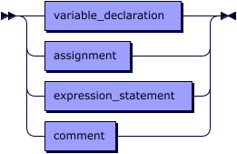

referenced by:
* [program](#program)

### variable_declaration:


referenced by:
* [statement](#statement)

### assignment:


referenced by:
* [statement](#statement)

### expression_statement:


referenced by:
* [statement](#statement)

### comment:

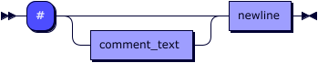

referenced by:
* [statement](#statement)

### comment_text:

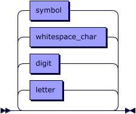

referenced by:
* [comment](#comment)

### expression:


referenced by:
* [argument_list](#argument_list)
* [assignment](#assignment)
* [expression_statement](#expression_statement)
* [primary](#primary)

### term:


referenced by:
* [expression](#expression)

### term_op:

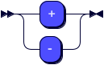

referenced by:
* [term](#term)

### factor:

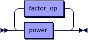

referenced by:
* [term](#term)

### factor_op:

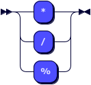

referenced by:
* [factor](#factor)

### power:

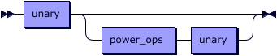

referenced by:
* [factor](#factor)

### power_ops:

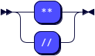

referenced by:
* [power](#power)

### unary:

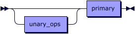

referenced by:
* [power](#power)

### unary_ops:


referenced by:
* [unary](#unary)

### primary:

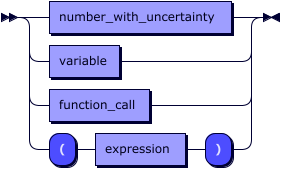

referenced by:
* [unary](#unary)

### number_with_uncertainty:

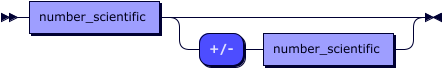

referenced by:
* [primary](#primary)

### function_call:

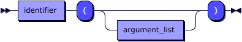

referenced by:
* [primary](#primary)

### argument_list:

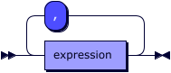

referenced by:
* [function_call](#function_call)

### variable:


referenced by:
* [primary](#primary)

### identifier:

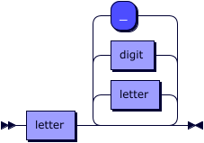

referenced by:
* [assignment](#assignment)
* [function_call](#function_call)
* [variable](#variable)
* [variable_declaration](#variable_declaration)

### number:

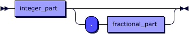

referenced by:
* [number_scientific](#number_scientific)

### number_scientific:

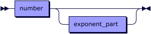

referenced by:
* [number_with_uncertainty](#number_with_uncertainty)

### exponent_part:

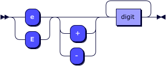

referenced by:
* [number_scientific](#number_scientific)

### integer_part:


referenced by:
* [number](#number)

### fractional_part:


referenced by:
* [number](#number)

### letter:

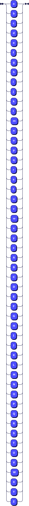

referenced by:
* [comment_text](#comment_text)
* [identifier](#identifier)

### digit:

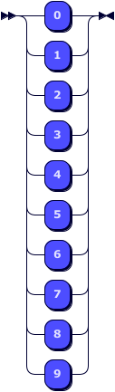

referenced by:
* [comment_text](#comment_text)
* [exponent_part](#exponent_part)
* [fractional_part](#fractional_part)
* [identifier](#identifier)
* [integer_part](#integer_part)

### newline:

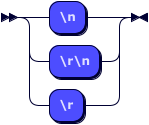

referenced by:
* [comment](#comment)
* [whitespace](#whitespace)

### whitespace_char:

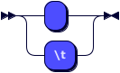

referenced by:
* [comment_text](#comment_text)
* [whitespace](#whitespace)

### symbol:

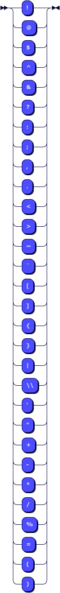

referenced by:
* [comment_text](#comment_text)

### whitespace:

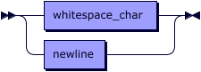
