# Significance

```
(Tripp) Milton Lamb
11/26/2025
CS-524 Fall
```

## 1. Overview

Significance is a toy programming language created for CS-524. The interpreter (an executable of the same name) is written in Rust. The interpreter is capable of REPL (read-eval-print-loop) and full file parsing.

Simply invoking the executable in a terminal will start the REPL.

```
Significance.exe
```

> Note: the REPL still has some bugs, and is not fully ready for use

By passing a file path as an argument to the executable, the file parsing will initiate.

```
Significance.exe <filename>
```

> Currently, in order to support the second delivery, running Significance on a file will also produce an 'ast.json' file in the current working directly. This JSON file is a rendering of the Abstract Syntax Tree generated by parsing the filename argument. This feature will be removed or made optional via command line optional argument in the final version.

## 2. Language Basics

Most of the available features of Significance follow expected behavior. The major differences are the reduction of feature size and the inclusion of uncertainty as part of the native behavior of the language.

### 2.1 Native Type

There is only a single native type in significance; the `real` type. The `real` type can behave very similarly to a standard double precision number; however, there is optional uncertainty behavior. When the uncertainty behavior is not assigned it will still be propagated, but the propagated value is simply `0.0`.

> As an example the two below methods are equivalent.
>
> ```
> x := 5.2
> ```
>
> and
>
> ```
> x := 5.2 +/- 0.0
> ```
>
> The following still yields a base double precision number of `5.2`, but also includes an uncertainty value
>
> ```
> x := 5.2 +/- 0.02
> ```

`real` types are immutable. Once they are assigned a value they cannot be reassigned.

> Note: There is technically a single reassignment from the default `0.0 +/- 0.0` upon declaration, but this will likely change before the final release.

### 2.2 Statements

There are three kinds of statements in Significance.

#### 2.2.1 Declaration

The declaration statement is required in order to use a variable. A variable is declared by the pattern:

```
{<id> : <type>}
```

or concretely

```
{x : real}
```

There is only one implemented type in Significance so `<type>` can currently only be replaced by `real`. Once a variable has been declared it cannot be redeclared.

#### 2.2.2 Assignment

The second kind of statement available in Significance is the assignment statement which follows the pattern: 

```
<id> := <expression>
```

The expression usage should follow expectation. An expression can be a literal (`2.1 +/- 0.015`); an identifier (`x`); an expression following a unary operator (`-x`); two expressions connected with a binary operator (`x * 4.2 +/- 0.04`); or an internal function call (`sin(x)`).

#### 2.2.3 Expression Statement

The third kind of statement available in Significance is the print expression statement. If an expression exists without an assignment, the result of the expression will be printed to console.

```
<expression>
```

>An example:
>
>```
>{x :real}
>x = 5.0
>x # will print '5.0' to console
>```

### 2.3 Comments

Significance also supports single line comments. Anything following a pound symbol `#` but before a newline will be considered a comment, and will have no effect on the program execution.

### 2.4 Operators

#### 2.4.1 Binary Operators

| Symbol | Name | Description |
|--------|------|-------------|
| `+` | Addition | Adds two numbers, propagates uncertainty in quadrature |
| `-` | Subtraction | Subtracts two numbers, propagates uncertainty in quadrature |
| `*` | Multiplication | Multiplies two numbers, propagates relative uncertainty |
| `/` | Division | Divides two numbers, propagates relative uncertainty |
| `%` | Modulus | Returns remainder of division, |
| `**` | Power | Raises left operand to the power of right operand |
| `//` | Root | Takes the nth root (left // right = left^(1/right)) |
| := | immutable assignment | Assigns the right operand (expression) to the left operand (identifier) immutably |

##### 2.4.1.1 Uncertainties

All operators propagate the uncertainty of the operands. Addition and Subtraction propagate uncertainty in quadrature:
$$
\begin{align}
\text{Given } & a \pm \delta_a \text{ and } b \pm \delta_b \\
\text{Addition: } & z = a + b, \quad \delta_z = \sqrt{(\delta_a)^2 + (\delta_b)^2} \\
\text{Subtraction: } & z = a - b, \quad \delta_z = \sqrt{(\delta_a)^2 + (\delta_b)^2}
\end{align}
$$


while multiplication and division propagate relative uncertainty:
$$
\begin{align}
\text{Given } & a \pm \delta_a \text{ and } b \pm \delta_b \\
\text{Multiplication: } & z = a \times b, \quad \frac{\delta_z}{|z|} = \sqrt{\left(\frac{\delta_a}{|a|}\right)^2 + \left(\frac{\delta_b}{|b|}\right)^2} \\
\text{Division: } & z = \frac{a}{b}, \quad \frac{\delta_z}{|z|} = \sqrt{\left(\frac{\delta_a}{|a|}\right)^2 + \left(\frac{\delta_b}{|b|}\right)^2}
\end{align}
$$

Power and root operations use more complex propagation rules: 
$$
\begin{align} \text{Given } & a \pm \delta_a \text{ and } b \pm \delta_b \\ \\
\text{Power (when } \delta_b = 0\text{): } & z = a^b, \quad \delta_z = |b| \cdot |a^{b-1}| \cdot \delta_x \\
\text{Power (general case): } & z = a^b, \quad \left(\frac{\delta_z}{z}\right)^2 = \left(\frac{b \cdot \delta_a}{a}\right)^2 + \left(\ln(a) \cdot \delta_b\right)^2 \\
\text{Root: } & z = a^{1/c}, \quad \text{(applies power formula with } b = 1/c\text{)} \end{align}
$$
Modulus propagation depends on whether the divisor has uncertainty: 
$$
\begin{align}
\text{Given } & a \pm \delta_a \text{ and } b \pm \delta_b \\ \\
\text{Modulus (when } \delta_b = 0\text{): } & z = a \bmod b, \quad \delta_z \approx \delta_a \\
\text{Modulus (general case): } & z = a \bmod b, \quad \delta_z = \max(\delta_a, \delta_b) \quad \text{(conservative)} \end{align}
$$


#### 2.4.2 Unary Operators

Both unary operators are used. The unary plus operator doesn't actually do anything, but it is allowed for clarity. 

> Note: that the plus in the scientific notation form isn't actually a unary operator, it is part of the format of the exponent definition.

| Symbol | Name | Description |
|--------|------|-------------|
| `+` | Unary Plus | Returns the value unchanged |
| `-` | Unary Minus | Negates the value |

#### 2.4.3 Precedence Rules

The precedence rules should be as expected. The precedence rules of Significance follow the majority of other languages and mathematics in general.

| Symbol | Name | Precedence Level | Associativity |
|--------|------|------------------|---------------|
| `()` | Parentheses | 1 (highest) | N/A |
| `+`, `-` | Unary Plus/Minus | 2 | Right |
| `**`, `//` | Power, Root | 3 | Right |
| `*`, `/`, `%` | Multiplication, Division, Modulus | 4 | Left |
| `+`, `-` | Addition, Subtraction | 5 | Left |
| `:=` | Immutable Assignment* | 6 (lowest) | Right |

*Immutable assignment isn't technically associative or make use of a precedence level in Significance since it isn't part of an expression, only an assignment statement; however, it is still useful to be mentioned.

### 2.5 Functions

#### 2.5.1 Built-in Functions

| Function | Description |
|----------|-------------|
| `sin(x)` | Returns the sine of x [radians] |
| `cos(x)` | Returns the cosine of x [radians] |
| `sqrt(x)` | *Returns the square root of x |

*`sqrt(x)` is unnecessary in Significance since `x // 2.0` is equivalent, but it was a requirement of the language so it has been included.

##### 2.5.1.1 Uncertainties

All built-in functions propagate uncertainty according to standard first-order Taylor approximation methods. The uncertainty propagation formulas are: 
$$
\begin{align} 
\text{Given } & a \pm \delta_a \\ \\
\text{Sine: } & z = \sin(x), \quad \delta_z = |\cos(a)| \cdot \delta_a \\
\text{Cosine: } & z = \cos(x), \quad \delta_z = |\sin(a)| \cdot \delta_a \\ \\
\text{Square Root: } & \text{follows root operator formula (see §2.4.1)} 
\end{align}
$$
These formulas are derived from the general uncertainty propagation principle: $\delta_z \approx \left|\frac{df}{da}\right| \cdot \delta_a$.

#### 2.5.2 User Defined Functions

User defined functions do not exist in this language.

## 3. Interpreter Architecture

The interpreter can be initialized in two ways. The first is file parsing, and the other is a REPL. Both methods effectively make use of the same code base. Only the highest level code in the Significance language parser diverge.

The interpreter implements a straightforward path of interpretation, broken into 4 distinct sections. The significance interpreter passes an input string to the tokenizer which outputs a list of tokens. The tokens are then passed to the AST parser which returns an abstract syntax tree (AST). The AST is then passed into the semantic analyzer to be decorated and validated, and then into the executor to be executed.

The semantic analyzer holds onto its own symbol table, and the executor holds onto its own run time variable table. This design pattern is what allows the high code reuse between the file parsing pathway and the REPL pathway. In the file parsing pathway each of the 4 main code structures (tokenizer, AST parser, semantic analyzer, and executor) are instantiated when the file is read and then destroyed upon completing execution. In the REPL pathway the tokenizer is instantiated upon reading user input, but the others persist within the Significance language parser for the entirety of execution.

### 3.1 REPL Pathway

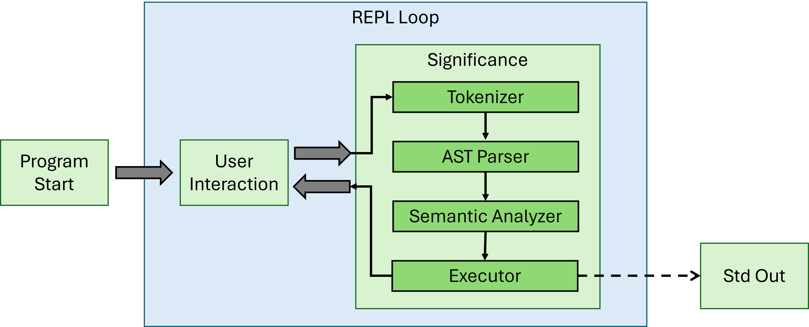

### 3.2 File Parse Pathway


### 3.3 Real Type

There is only one native type in the language as implemented: the `Real` type. It largely behaves as double precision floating-point type with an additional uncertainty term. If the uncertainty is absent or is `0.0`, it basically wraps the Rust `f64` type. The uncertainty calculation method is based on the operation being applied to the numbers in question. These methods are explained the operators and functions sections.

## 5. Example Programs

### 5.1 First Example

```
#This is a comment
#Below is an example program in significance

{x : real} # this is the `x` variable
{y : real} # this represents a change in `x`
{z : real} # `z` is the next iteration of `x`
{w : real} # `w` is the magnitude of `x` and `z`

x := 12.3 +/- 0.5    # assign 12.3 with uncertainty 0.5 to `x`
y := 2.6             # assign 2.6 with uncertainty 0.0 to `y`
z := x + y           # assign the sum of `x` and `y` to `z`
z                    # print `z` to console
w := x*x + z**2      # assign the sum of the square of `x` 
                     #     and the square of `z` to `w`
w
```

### 5.2 Second Example

```
sin(2.1 +/- 0.1) # print the result of taking the sine of the
                 #     literal `2.1 +/- 0.1`
```


## 6. Grammar

The grammar mathematics centric focusing on the idea of a variable belonging to a set `{x :: real}` and `:=` meaning defined as implying an immutability. The language grammar assumes an expression with no assignment is intended to be output to stdout.

If this language were to be developed further, the above concepts lay the path for declaring variables to belong to sets with restrictions such as `{x :: real, 0.0 <= x <= 10.0}` and multiple methods of assignment ` x = 5.0` for mutable, and `x => y` for reference assignment.

### 6.1 Readability, Writability, Reliability, and Cost

Being a toy language it is easy to keep it highly readable, writable, and orthogonal. 

The language should be highly readable and writable for a developer with a background in mathematics. Though there may be some brief acclimation needed for a developer only familiar with the most prevalent programming languages since `{...}` doesn't mean a dictionary/hash map or similar. Of course `:=` is more difficult to write when there is only a single option, but as the intention is to leave this open for implementation of other assignment methods it shouldn't be considered a terrible trade-off. The multiple assignment methods would surely improve readability.

There is only a single native type (`Real`)...

### 6.1 EBNF

Below is the complete EBNF grammar of Significance, following the ISO/IEC 14977 standard, by R. S. Scowen.

> R. S. Scowen, "Extended BNF — A generic base standard," in *Proc. Software Engineering Standards Symposium (SESS'93)*, 1993.

```
(* Extended Backus-Naur Form for Significance Language *)
(* Supports arithmetic operations with uncertainty, variables, assignments, and comments *)

(* Entry point *)
program = { statement };

(* Statements *)
statement = variable_declaration
          | assignment
          | expression_statement
          | comment;

(* Variable declaration *)
variable_declaration = "{", identifier, ":", type, "}";

(* Type system *)
type = "real";

(* Assignment *)
assignment = identifier, ":=", expression;

(* Expression statement (gets printed to console) *)
expression_statement = expression;

(* Comments *)
comment = "#", [ comment_text ], newline;

comment_text = { letter | digit | whitespace_char | symbol };

(* Expressions *)
expression = term;

(* Addition and Subtraction (lowest precedence) *)
term = factor, { term_op, factor };


(* Multiplication, Division, and Modulus *)
factor = power, { factor_op, power };


(* Exponentiation and Root (right-associative) *)
power = unary, [ power_op, unary ];


(* Unary operations (unary minus/plus) *)
unary = [ unary_op ], primary;


(* Primary expressions (highest precedence) *)
primary = number_with_uncertainty
        | variable
        | function_call
        | "(", expression, ")";

(* Numbers with optional uncertainty *)
number_with_uncertainty = number_scientific, [ uncertainty_op, number_scientific ];

(* Uncertainty Operator *)
uncertainty_op = "+/-";

(* Function calls *)
function_call = identifier, "(", [ argument_list ], ")";

(* Function arguments *)
argument_list = expression, { ",", expression };

(* Variables and function names *)
variable = identifier;

(* Identifier definition *)
identifier = letter, { letter | digit | "_" };

(* Numbers *)
number = integer_part, [ ".", fractional_part ];

(* Scientific notation numbers *)
number_scientific = number, [ exponent_part ];

exponent_part = ( "e" | "E" ), [ unary_op ], digit, { digit };

integer_part = digit, { digit };

fractional_part = digit, { digit };

(* Terminating Non-terminals *)

(* Operators for the term non-terminal*)
term_op = "+" | "-";

(* Operators for the factor non-terminal*)
factor_op = "*" | "/" | "%";

(* Operators for the power non-terminal*)
power_op = "**" | "//";

(* Operators for the unary non-terminal*)
unary_op = "+" | "-";

letter = "a" | "b" | "c" | "d" | "e" | "f" | "g" | "h" | "i" | "j" 
       | "k" | "l" | "m" | "n" | "o" | "p" | "q" | "r" | "s" | "t" 
       | "u" | "v" | "w" | "x" | "y" | "z"
       | "A" | "B" | "C" | "D" | "E" | "F" | "G" | "H" | "I" | "J" 
       | "K" | "L" | "M" | "N" | "O" | "P" | "Q" | "R" | "S" | "T" 
       | "U" | "V" | "W" | "X" | "Y" | "Z";

digit = "0" | "1" | "2" | "3" | "4" | "5" | "6" | "7" | "8" | "9";


newline = "\n" | "\r\n" | "\r";

whitespace_char = " " | "\t";

symbol = "!" | "@" | "$" | "^" | "&" | "?" | ":" | ";" | "," | "." | "<" | ">" | "~" | "`"
       | "[" | "]" | "{" | "}" | "|" | "\" | "'" | '"' | "+" | "-" | "*" | "/" | "%" | "=" | "(" | ")";

(* Whitespace *)
whitespace = whitespace_char | newline;
```

### 6.2 Railroad Diagrams

Bottle Caps (https://www.bottlecaps.de/rr/ui) was used to generate railroad diagrams for the grammar. 

#### program:


#### statement:

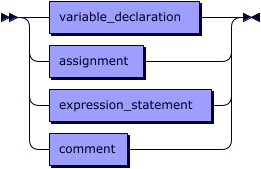

referenced by:
* [program](#program)

#### variable_declaration:


referenced by:
* [statement](#statement)

#### assignment:

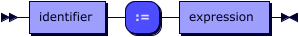

referenced by:
* [statement](#statement)

#### expression_statement:

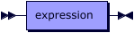

referenced by:
* [statement](#statement)

#### comment:

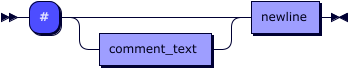

referenced by:
* [statement](#statement)

#### comment_text:

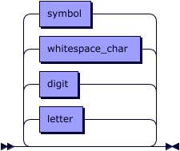

referenced by:
* [comment](#comment)

#### expression:

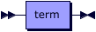

referenced by:
* [argument_list](#argument_list)
* [assignment](#assignment)
* [expression_statement](#expression_statement)
* [primary](#primary)

#### term:


referenced by:
* [expression](#expression)

#### term_op:


referenced by:
* [term](#term)

#### factor:

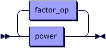

referenced by:
* [term](#term)

#### factor_op:

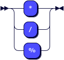

referenced by:
* [factor](#factor)

#### power:

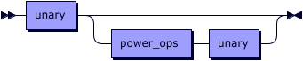

referenced by:
* [factor](#factor)

#### power_ops:

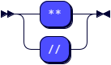

referenced by:
* [power](#power)

#### unary:

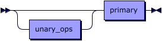

referenced by:
* [power](#power)

#### unary_ops:

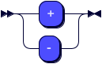

referenced by:
* [unary](#unary)

#### primary:

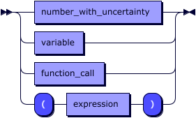

referenced by:
* [unary](#unary)

#### number_with_uncertainty:

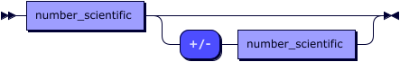

referenced by:
* [primary](#primary)

#### function_call:

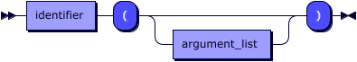

referenced by:
* [primary](#primary)

#### argument_list:

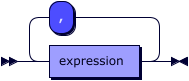

referenced by:
* [function_call](#function_call)

#### variable:

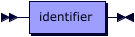

referenced by:
* [primary](#primary)

#### identifier:

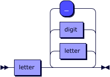

referenced by:
* [assignment](#assignment)
* [function_call](#function_call)
* [variable](#variable)
* [variable_declaration](#variable_declaration)

#### number:

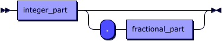

referenced by:
* [number_scientific](#number_scientific)

#### number_scientific:

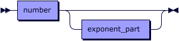

referenced by:
* [number_with_uncertainty](#number_with_uncertainty)

#### exponent_part:

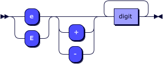

referenced by:
* [number_scientific](#number_scientific)

#### integer_part:


referenced by:
* [number](#number)

#### fractional_part:


referenced by:
* [number](#number)

#### letter:

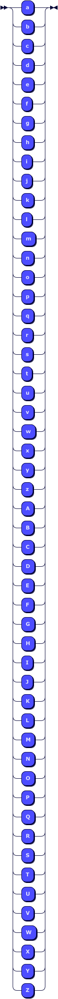

referenced by:
* [comment_text](#comment_text)
* [identifier](#identifier)

#### digit:

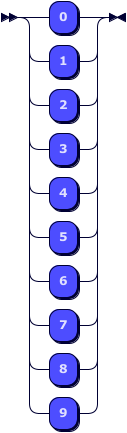

referenced by:
* [comment_text](#comment_text)
* [exponent_part](#exponent_part)
* [fractional_part](#fractional_part)
* [identifier](#identifier)
* [integer_part](#integer_part)

#### newline:

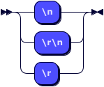

referenced by:
* [comment](#comment)
* [whitespace](#whitespace)

#### whitespace_char:

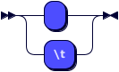

referenced by:
* [comment_text](#comment_text)
* [whitespace](#whitespace)

#### symbol:

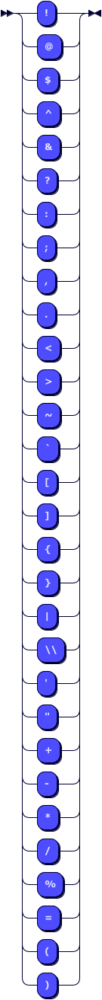

referenced by:
* [comment_text](#comment_text)

#### whitespace:

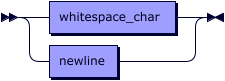
